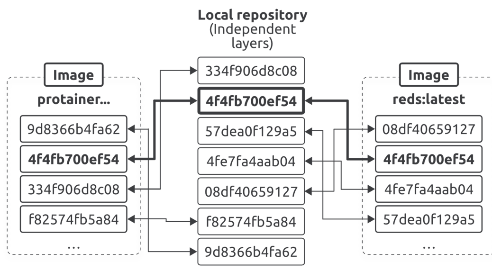

# Chapter 2: Working with Images

## What is an image?

* An image is a read-only package containing everything you need to run an application.
  
* This means they include application code, dependencies, a minimal set of OS constructs,and metadata.
* You can start multiple containers from a single image.
* The easiest way to get an image is to pull one from a registry
* `Docker Hub` is the most common registry, and pulling an image downloads it to your local machine where Docker can use it to start one or more containers.
* Other registries exist, and Docker works with them all.
* Images are made by stacking independent layers and representing them as a single unified object.
    * One layer might have the OS components
    * another layer might have application dependencies
    * another layer might have the application
    * Docker stacks these layers and makes them look like a unified system.
 

## More on Images

* images are like stopped containers.
  
* You can stop a container and create a new image from it.
* images are build-time constructs, whereas containers are run-time constructs.
* To start a container from an image:
    ```bash
    docker run
    ```
* Once the container is running, the image and the container are bound.
    * you cannot delete the image until you stop and delete the container.
    * If multiple containers use the same image, you can only delete the image after you’ve deleted all the containers using it.
* Containers are designed to run a single application or microservice.
    * As such, they should only contain application code and dependencies.
    * You should not include non-essentials such as build tools or troubleshooting tools.
    * if the application doesn’t need it at run-time, the image doesn’t include it. We call these slim images.

## Pulling images
* A clean Docker installation has an empty `local repository`.
  
* Local repository is an area on your local machine where Docker stores images for more convenient access.
* on Linux it’s usually located in `/var/lib/docker/<storage-driver>`.
* However, it will be inside the Docker VM if you’re using Docker Desktop.
* To inspect the images on your local repo, run this command:
    ```bash
    docker images
    ```
 * The process of getting images is called pulling.
 * Run the following commands to pull the redis image and verify it exists in your local repository.
     ```bash
     docker pull redis
     ```
     Output:
     ```
     $ docker images
      REPOSITORY   TAG       IMAGE ID       CREATED        SIZE
      ubuntu       latest    590e57acc18d   6 days ago     117MB
      redis        latest    acb90ced0bd7   4 weeks ago    200MB
      postgres     16        66a5efb5677f   4 weeks ago    637MB
      nginx        latest    d5f28ef21aab   4 weeks ago    279MB
      alpine       latest    4bcff63911fc   2 months ago   12.8MB
     ```
     * Docker made two assumptions when pulling the image.
         * It assumed you wanted to pull the image tagged as latest.
           
         * It assumed you wanted to pull the image from Docker Hub.
         * You can override both, but Docker will use these as defaults if you don’t override them.
      * The Redis image has eight layers. However, Docker only pulled seven layers because it already had a local copy of one of them.
        
         * This is because my system runs the Portainer Docker Desktop extension, which is based on an image that shares a common layer with the Redis image.
      * images can share layers, and Docker is clever enough only to pull the layers it doesn’t already have


## Image registries

* We store images in centralized places called registries.
  
* The job of a registry is to securely store images and make them easy to access from different environments.
* So we build the image, push it to a registery, and then that image can be pulled from the registery.
* Image registries contain one or more image repositories, and image repositories contain one or more images.
* Docker Hub has the concept of official repositories that are home to images vetted and curated by Docker and the application vendor.


 ## Image naming and tagging

 * The name of the image has the form: `<Registry>/<User/Org>/<Repository>:<image/tag>`
   * Example: `docker.io/library/nginx:1.27-alpine`
       *  Registry: `docker.io` (Docker Hub, default so you don't need to type it)
       *  User/Org: `library` (official images live here).
       *  Repository: `nginx`.
       *  Tag: `1.27-alpine`
       *  You normally just type `nginx:1.27-alpine` because docker.io/library is implied.
 * Addressing images from official repositories is easy. All you need to supply is the repository name and image name separated by a colon.
 * Sometimes we call the image name the tag.
 * The format for a docker pull command pulling an image from an official repository is:
    ```bash
    docker pull <repository>:<tag>
    ```
     * Example_1:
       ```bash
        docker pull redis:latest
       ```
       * pulls the image tagged as latest from the top-level redis repository.
     * Example_2:
       ```bash
       docker pull mongo:7.0.5
       ```
       * Pulls the image tagged as '7.0.5' from the official 'mongo' repository.

     * Example_3:
       ```bash
       docker pull busybox:glibc
       ```
       * Pulls the image tagged as 'glibc' from the official 'busybox' repository.

      
     * Example_4:
       ```bash
       docker pull alpine
       ```
       * Pulls the image tagged as 'latest' from the official 'alpine' repository.

 
 * Important Note: **Images tagged as latest are not guaranteed to be the most up-to-date in the repository.**
 * The format for a docker pull command pulling an image from the docker registry but from a unofficial repositories is: `<User/Org>/<Repository>:<image/tag>`
   * Example:
     ```bash
     docker pull nigelpoulton/tu-demo:v2
     ```
 * The format for a docker pull command pulling an image from a different registry is: `<Registry>/<User/Org>/<Repository>:<image/tag>`
   * Example:
     ```bash
     docker pull ghcr.io/regclient/regsync:latest
     ```
     * Output:
       ```bash
       latest: Pulling from regclient/regsync
        6f14f2b64ccf: Download complete
        7746d6728537: Download complete
        685af2c79c31: Download complete
        4c377311167a: Download complete
        662e9541e042: Download complete
        Digest: sha256:149a95d47d6beed2a1404d7c3b00dddfa583a94836587ba8e3b4fe59853c1ece
        Status: Downloaded newer image for ghcr.io/regclient/regsync:latest
        ghcr.io/regclient/regsync:latest
       ```

     * Notice how the pull looks the same as it did with Docker Hub.
     * This is because GHCR supports the OCI registry-spec and implements the Docker Registry v2 API.
 * Note: **You can give a single image as many tags as you want.**


## Images and layers

* images are a collection of loosely connected read-only layers where each layer comprises one or more files.
  
* Docker takes care of stacking them and representing them as a single unified image.
 <p align="center">
  
 </p>

 * Example: Pull the following image
   ```bash
   docker pull node:latest
   ```
   * Output:
     ```bash
     latest: Pulling from library/ubuntu
      952132ac251a: Pull complete
      82659f8f1b76: Pull complete
      c19118ca682d: Pull complete
      8296858250fe: Pull complete
      24e0251a0e2c: Pull complete
      Digest: sha256:f4691c96e6bbaa99d...28ae95a60369c506dd6e6f6ab
      Status: Downloaded newer image for node:latest
      docker.io/node:latest
     ```
    * Each line ending with Pull complete represents a layer that Docker pulled.
    * This image has five layers.
  * Another way to see image layers is to inspect the image with the `docker inspect` command.
    ```bash
    docker inspect node:latest
    ```
    * Output:
      ```bash
      [
          {
            "Id": "sha256:bd3d4369ae.......fa2645f5699037d7d8c6b415a10",
            "RepoTags": [
              "node:latest"
            <Snip>
            "RootFS": {
              "Type": "layers",
              "Layers": [
                "sha256:c8a75145fc...894129005e461a43875a094b93412",
                "sha256:c6f2b330b6...7214ed6aac305dd03f70b95cdc610",
                "sha256:055757a193...3a9565d78962c7f368d5ac5984998",
                "sha256:4837348061...12695f548406ea77feb5074e195e3",
                "sha256:0cad5e07ba...4bae4cfc66b376265e16c32a0aae9"
              ]
            }
          }
      ]
      ```

    * The trimmed output shows the five layers.
    * However, it shows their `SHA256` hashes, which are different from the short IDs shown in the docker pull output.


  * All Docker images start with a base layer.
  * Every time you add new content, Docker adds a new layer.
  * Example:
    * Base layer: official Ubuntu 24.04 image (corporate policy requirement).
    * Second layer: install Python on top of Ubuntu.
    * Third layer: add application source code, creating the final image with three layers. 
    <p align="center">
     
    </p>

# What is a layer?

* A layer is a snapshot of filesystem changes, stored as compressed tar archives on disk or in a 
  registry. It contains:
    1. The actual files (new or modified) → yes, the real file data is stored.
    2. Metadata about deletions (whiteouts) → so Docker knows to “hide” files from lower layers.
    3. Directory structure → so paths exist correctly.
* Each layer is identified by a content hash (digest).
* A layer is immutable. You can't modify a layer after creating it.
* A layer is not just a blueprint (like a recipe). It’s the actual binary diff of the filesystem at that step. Docker images are built from these diffs stacked together.
* Example: Given this DockerFile
  ```bash
  FROM alpine:3.18
  RUN echo "hello" > /file1
  RUN echo "world" > /file2
  ```
  * Step_1: `FROM alpine:3.18`
    * Docker pulls the base image alpine:3.18.
    * That base image already has several layers (the minimal Alpine Linux filesystem).
    * Let’s say Alpine has Layers A1,A2,A3.
    * Layer A1 = the first layer of your image.
  * Step_2: `RUN echo "hello" > /file1`
    * Docker starts a temporary container from Layers A1+A2+A3.
    * Runs the command → creates /file1.
    * Docker commits the filesystem diff:
      * New file /file1 (content "hello").
    * Layer B is created → contains /file1
  * Step 3: `RUN echo "world" > /file2`
    * Docker again starts a container from Layers A1+A2+A3 + B
    * Runs the command → creates /file2.
    * Docker commits the filesystem diff:
      * New file /file2 (content "world")
    * Layer C is created → contains /file2. 

  * Final Image:
    * The image now has 5 layers (A1+A2+A3 + B + C)
    * When you run a container, Docker uses OverlayFS to stack them
    * If you cat /file1, the kernel reads it from Layer B.
    * If you cat /file2, it comes from Layer C.
    * If you modify /file1 inside the container, the change goes into the writable container layer, not back into Layer B. (More on this later)
   
* Key takeaway:
  * Each Dockerfile instruction = 1 new layer (or layers).
  * That layer = "the filesystem changes made by that instruction."
  * Layers stack to form the full image.
   
## The Full Picture

### 1. What is a Layer? 
* A layer = the filesystem changes (add/modify/delete files) produced by a single Dockerfile instruction.
* It contains the actual files (not just a blueprint) + deletion markers (whiteouts)
* Layers are:
  * Immutable (never change once created).
  * Read-only (containers can’t modify them).
  * Shared (different images can reuse the same layer).
* Example: `RUN echo "hello" > /file1`
  * This creates a new layer containing just `/file1`.
    
### 2. What is an image?
* A Docker image = metadata + layers.
* Layers: read-only filesystem diffs.
* Metadata: JSON config that says:
  * Which layers belong to this image (by SHA256 digest).
  * In what order to stack them.
  * Runtime info: default command (CMD), entrypoint, env vars, exposed ports, etc.
* The image itself is not one big file. It’s a manifest pointing to multiple layers.

```bash
Image: nginx:alpine
 ├── Metadata (config.json, manifest.json)
 ├── Layer 1 (Alpine root filesystem)
 ├── Layer 2 (libs + nginx binaries)
 └── Layer 3 (config adjustments)
```

### 3. Containers and Layers

* Docker takes the image layers (read-only).
* Adds a thin writable container layer on top.
* All changes (logs, temp files, writes) go into that writable layer.
* Once the container is removed, that writable layer is gone.
```bash
Container filesystem:
 ├── Image layers (read-only, stacked)
 └── Container layer (writable, temporary)
```

### 4. Storage

* Locally:
  * Layers stored under /var/lib/docker/overlay2/ (or similar).
  *  Metadata stored in /var/lib/docker/image/.
* In registries (like Docker Hub):
  * Layers are stored as blobs (`sha256:...`).
  * Metadata is stored as JSON manifests/configs.

### 5. Running a Container
* When you docker run an image:
  * Lowerdirs: All image layers (read-only) become the lowerdirs directory
    ```bash
    /var/lib/docker/overlay2/<layer1>/diff
    /var/lib/docker/overlay2/<layer2>/diff
    /var/lib/docker/overlay2/<layer3>/diff
    ```
  * Upperdir: Docker creates a new empty writable directory for this container:
    ```bash
    /var/lib/docker/overlay2/<container-id>/diff
    ```
  * Overlay mount: The Linux kernel (via OverlayFS, overlay2 driver) merges them into a single view:
    ```bash
    lowerdir = image layers
    upperdir = container writable layer
    merged   = unified filesystem the process sees
    workdir  = scratch area for OverlayFS
    ```
* Inside the container, when a process accesses a file:
  * Kernel first checks upperdir (container layer).
  * If file isn’t there, it checks lowerdirs (image layers, top → bottom).
  * If file was deleted, a whiteout marker in upperdir hides it.
  * To you inside the container: it looks like one normal filesystem `/`.
  * To the kernel: it’s a merged mount that pulls from multiple dirs.

```bash
Docker Image (read-only)
  ├── Layer 1: Alpine base (/bin, /lib, /etc)
  ├── Layer 2: curl installed (/usr/bin/curl)
  └── Layer 3: app code (/app)

Container filesystem
  ├── lowerdirs: [Layer1, Layer2, Layer3]
  ├── upperdir:  /var/lib/docker/overlay2/<container-id>/diff (writable)
  └── merged:    what the container process sees as "/"

File lookup
  - Reads: check upperdir → then lowerdirs
  - Writes: go to upperdir
  - Deletes: whiteout in upperdir hides lowerdir file
```

## Sharing image layers    
* Docker images are made of multiple read-only layers.
* When you pull or build images, Docker stores all these layers in a local repository on your machine.
* Each layer is identified by a unique hash (like 4f4fb700ef54).
* Different images can share common layers
  <p align="center">
    
   </p>
* For example, the protainer image and the redis:latest image both reuse the layer `4f4fb700ef54`
* Docker only stores that layer once locally, even though multiple images reference it.
* This design saves disk space and bandwidth:
  * Pulling a new image only downloads the layers you don’t already have.
  * Building a new image can reuse existing layers from previous builds.
* So the diagram shows:
  * The middle column = your local repository of all unique layers.
  * The sides = two different images (protainer and redis), each defined as an ordered stack of layers.
  * The arrows = how both images reference and share layers from the same local repository.
 
## Pulling images by digest

### 1. Tags (Reminder)
* A tag is just a human-friendly label for an image.
* Problem: tags are mutable → you can reuse the same tag for a different image.
* If you push a new image with tag golftrack:1.5, it overwrites the old one.
* Now you can’t easily tell which containers are running the old vs new golftrack:1.5.

### 2. Digests
* A digest is a unique cryptographic hash (SHA256) of the image’s contents.
* They are immutable.
* If anything inside the image changes (even one byte), the digest changes.
* Two different images can never have the same digest.
* That’s why digests are reliable identifiers for images.
* If you pull alpine:latest today, you get one image.
* If you pull alpine:latest next year, you’ll probably get a newer image (same tag, different content).
* But if you pull by digest, you’ll always get the exact same image every time.
* To see digests of images you already have:
  ```bash
  docker images --digests alpine
  ```
  * The digest uniquely identifies this alpine:latest image.
* Find digest without pulling (using buildx imagetools):
  ```bash
  docker buildx imagetools inspect nigelpoulton/k8sbook:latest
  ```
  * output: `Digest: sha256:13dd59a0c74e9a1478...bce2e14b`
* To pull by digest:
  ```bash
  docker pull nigelpoulton/k8sbook@sha256:13dd59a0c74e9a1478...bce2e14b
  ```
  * This guarantees you pull that exact version, not whatever latest points to at the moment.

 ## Image hashes and layer hashes

 * images are just a loose collection of independent layers.
 * This means an image is just a manifest file with some metadata and a list of layers.
 * The actual application and all its dependencies live in the layers.
 * However, layers are fully independent and have no concept of being part of an image.
 * With this in mind, images and layers have their own digests as follows:
   * Images digests are a crypto hash of the image manifest file
   * Layer digests are a crypto hash of the layer’s contents
* This means all changes to layers or image manifests result in new hashes, giving us an easy and reliable way to know if changes have been made.

## Multi-architecture Images

* Tags like alpine:latest may point to different builds for different CPU architectures (x86_64, ARM, PowerPC, etc.). Without multi-arch support, users had to manually choose the right image for their system.
* Docker registries now support multi-architecture images:
  * A manifest list points to multiple manifests (one per architecture).
  * Each manifest lists the layers for that specific architecture build.
  * Example: docker pull alpine:latest automatically gives the AMD64 image on an AMD64 host, or the ARM image on an ARM host.
* Tools:
  ```bash
  docker buildx imagetools inspect <image>
  ``` 
    * shows the manifest list and supported architectures.
  ```bash
  docker manifest inspect <image>
  ```
    * similar output, useful for scripting.
  
 *  docker buildx supports creating images for multiple architectures:
    *  Emulation (via QEMU): works locally but is slow, no shared cache.
    *  Docker Build Cloud: fast, native builds in the cloud, shared cache, integrates with GitHub Actions/CI (paid service).
  

## Deleting Images

* You can delete images using the docker rmi command
* Deleting images removes them from your local repository and they’ll no longer show up in your docker images commands.
* The operation also deletes all directories on your local filesystem containing layer data.
* However, Docker won’t delete layers shared by multiple images until you delete all images that reference them.
* You can delete images by name, short ID, or SHA. You can also delete multiple images with the same command.
* The following command deletes three images — one by name, one by short ID, and one by SHA.
  ```bash
  docker rmi redis:latest af111729d35a sha256:c5b1261d...f8e1ad6b
  ```
* Docker will prevent the delete operation if the image is being used by a container or referenced by more than one tag
* However, you can force the operation with the -f flag, but you should do so with caution, as forcing Docker to delete an image in use by a container will untag the image and leave it on the system as a dangling image.
* A handy way to delete all images is to pass a list of all local image IDs to the docker rmi command
  ```bash
  docker rmi $(docker images -q) -f
  ```
  * `docker images -q` returns a list of local image IDs


