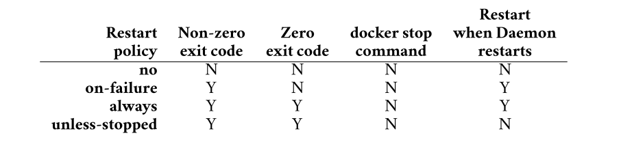

# Chapter 3: Working with containers

* Containers are run-time instances of images, and you can start one or more containers from a single image.

* You can start, stop, restart, and delete containers just like you can with VMs.
* Containers are smaller, faster, and more portable than VMs.
* They’re also designed to be stateless and ephemeral.
* Containers are also designed to be immutable.
  * This means you shouldn’t change them after you’ve deployed them .
  * If a container fails, you replace it with a new one instead of connecting to it and making the fix in the live instance.
* Containers should only run a single process and we use them to build microservices apps.
  * For example, an application with four features (microservices), such as a web server, auth, catalog, and store, will have four containers
    * one running the web server
    * one running the web server
    * one running the web server
    * one running the web server
   

## Containers vs VMs

* Containers and VMs are both virtualization technologies for running applications.
* However, the ways they virtualize are very different:
  * VMs virtualize hardware.
  * Containers virtualize operating systems.
 ### 1. Virutal Machines: 
* In the VM model, you power on a server and a hypervisor boots.
* When the hypervisor boots, it claims all hardware resources such as CPU, RAM, storage, and network adapters.
* To deploy an app, you ask the hypervisor to create a virtual machine.
* It does this by carving up the hardware resources into virtual versions, such as virtual CPUs and Virtual RAM, and packaging them into a VM that looks exactly like a physical server.
* Once you have the VM, you install an OS and then an app

 ### 2. Container Model:
* you power on the same server and an OS boots and claims all hardware resources.
* You then install a container engine such as Docker.
* You then install a container engine such as Docker.
* It does this by carving up OS resources such as process trees and filesystems into virtual versions and then packaging them as a container that looks exactly like a regular OS.
* You then tell Docker to run the app in the container.

<p align="center">
    
   </p>

* Containers are smaller than VMs because they only contain application code and a minimal set of OS-related constructs, such as essential filesystem objects.
* Because of this, they’re typically only a few megabytes in size.
* On the other hand, every VM needs a full OS, meaning they’re usually hundreds or thousands of megabytes.
* Containers also start faster than VMs because they use the host’s OS which is already booted.
* On the other hand, VMs need to go through a full OS bootstrapping process before starting the app.

## Images and Containers

* The image is read-only in this relationship, but each container is read-write.
* Docker accomplishes this by creating a thin read-write layer for each container and placing it on top of the shared image.
  <p align="center">
    
   </p>
* In this example, each container has its own thin R/W layer but shares the same image.
* The containers can see and access the files and apps in the image through their own R/W layer, and if they make any changes, these get written to their R/W layer
* When you stop a container, Docker keeps the R/W layer and restores it when you restart the container.
* When you stop a container, Docker keeps the R/W layer and restores it when you restart the container.
* This way, each container can make and keep its own changes without changing the shared image

## Containers Quick Start using an example 

### 1. Check Docker is running
* Run a docker version to check Docker is running
  ```bash
  docker version
  ```
### 2. Starting a container
* The docker run command is the simplest and most common way to start a new container.

* Run the following command to start a new container called webserver.
  ```bash
  docker run -d --name webserver -p 5005:8080 nigelpoulton/ddd-book:web0.1
  ```
     * `-d` flag: tells Docker to run it in the background as a daemon process and detached from your local terminal
       * Without `-d`, the container runs in the foreground and you’ll see all of its logs in your terminal. You’d need another terminal tab to keep working.
       * With `-d`, the container runs as a background process, and Docker prints the container ID (`b5594b3`... in your case)
     * `name` flag: tells Docker to name this container `webserver`.

     * `-p 5005:8080` flag: flag maps port 5005 on your local system to port 8080 inside the container.
       * `8080` (container port): the app inside the container listens on `port 8080`.
       * `5005` (host port): you expose it to your machine (the host) on `port 5005`.
       * If you open `http://localhost:5005` in your browser, Docker forwards that traffic into the container’s port `8080`.
       * Without this mapping, the container’s web server would still run, but only inside the container — your host system wouldn’t see it.
       * Container says: “I’m listening on port 8080.”. Host says: “Okay, I’ll let people talk to you through my port 5005.”
       * Docker wires 5005 → 8080.
     * The `nigelpoulton/ddd-book:web0.1` argument tells Docker which image to use to start the container.
     * When you hit `Return`, the Docker client converted the command into an API request and posted it to the Docker API exposed by the Docker daemon.
     * The Docker daemon accepted the command and searched its local image repository for a copy of the `nigelpoulton/ddd-book:web0.1` image.
     * It didn’t find one, so it searched Docker Hub. In the example, it found one on Docker Hub and pulled a local copy.
     * Once it had a local copy of the image, the daemon made a request to containerd asking for a new container.
     * containerd then instructed runc to create the container and start the app. It also performed the port mapping.

* Run the following command to verify the image was pulled locally:
  ```bash
  docker images
  ```
  * Ouput:
   ```bash
   nigelpoulton/ddd-book   web0.1    24e712542f5f   9 months ago   208MB
   ```
* Run the following command a new container called webserver is running:
  ```bash
  docker ps
  ```
  * Ouput:
    ```bash
    CONTAINER ID   IMAGE                          COMMAND           CREATED          STATUS          PORTS                                         NAMES
    e9686ad32140   nigelpoulton/ddd-book:web0.1   "node ./app.js"   42 minutes ago   Up 42 minutes   0.0.0.0:5005->8080/tcp, [::]:5005->8080/tcp   webserver
    ```
* To test the app, connect to the browser and run:
  ```bash
  http://localhost:5005/
  ```
* Congratulations. Docker pulled a local copy of the image and started a container running the app defined in the image.


## How containers start apps

* In the previous section, you created a container running a web app.
* But how did the container know which app to start and how to start it?
* There are three ways you can tell Docker how to start an app in a container:
  * **1. An Entrypoint instruction in the image.**
  * **2. A Cmd instruction in the image.**
  * **3. A CLI argument.** 

* Entrypoint and Cmd instruc-tions are optional image metadata that store the command Docker uses to start the default app.

* Then, whenever you start a container from the image, Docker checks the Entrypoint or Cmd instruction and executes the stored command.
* Entrypoint instructions cannot be overridden on the CLI, and anything you pass in via the CLI will be appended to the Entrypoint instruction as an argument.
* Cmd instructions can be overridden by CLI arguments
* Run the following command to see if the nigelpoulton/ddd-book:web0.1 image has an Entrypoint instruction.
  ```bash
  docker inspect nigelpoulton/ddd-book:web0.1 | grep Entrypoint -A 3
  ```
  * The command searches the image metadata and returns any lines containing the word “Entrypoint” and the three lines immediately following it.
  * Output:
    ```bash
    "Entrypoint": [
                "node",
                "./app.js"
            ],
    ```

  * This image has an Entrypoint instruction that translates into the following command — `node ./app.js`.
  * If you’re not familiar with Node.js, it’s a simple command telling the Node.js runtime to execute the code in the `app.js` file. 

* If an image doesn’t have an Entrypoint instruction, you can search for the presence of a Cmd instruction.
* If an image doesn’t have either, you’ll need to pass an argument on the CLI.
* The format of the docker run command is:
  ```bash
  docker run <arguments> <image> <command>
  ```
  * As mentioned, the <command> is optional
  * you don’t need it if the image has an Entrypoint or Cmd instruction.
  * f you specify a <command>, it will override a Cmd instruction but will be appended to an Entrypoint instruction.
  * Example:
    ```bash
    docker run --rm -d alpine sleep 20
    ```
    * The following command starts a new background container based on the Alpine image and tells it to run the sleep 20 command, causing it to run for 20 seconds and then exit.
    * The --rm flag cleans up the exited container so you don’t have to delete it manually.
    * If you run a docker ps command before the 20-second sleep timer expires, you’ll see the container in the output
    * If you run it after 20 seconds, the container will be gone.The `--rm` argument automatically cleans up the exited container.

* Most production images will specify an Entrypoint or Cmd instruction.


## Connecting to a container

* You can use the docker exec command to execute commands in running containers, and it has two modes:
 * Interactive: Interactive exec sessions connect your terminal to a shell process in the container and behave like remote SSH sessions.
 * Remote execution: Remote execution mode lets you send commands to a running container and prints the output to your local terminal.
* Run the following command to start an interactive exec session by creating a new `shell process` (sh) inside the webserver container and connecting your terminal to it.
  ```bash
  docker exec -it webserver sh
  ```
  * The `-it`flag makes it an interactive exec session
  * `sh argument` starts a new sh process inside the container. `sh` is a minimal shell program installed in the container.
  * your terminal is now connected to the shell process inside the container.

* Try executing a few common Linux commands. Some will work, and some won’t.
* This is because container images are usually optimized to be lightweight and don’t have all of the normal commands and packages installed.


## Inspecting container processes

* Most containers only run a single process.
* This is the container’s main app process and is always PID 1.
* Example: Run a ps command to see the processes running in your container. You’ll need to be connected to the exec session from the previous section for these commands to work.
  ```bash
  ps
  ```
  * The output shows three processes:
   * PID 1 is the main application process running the Node.js web app
   * PID 13 is the shell process your interactive exec session is connected to
   * PID 22 is the ps command you just ran 
  
  * The ps process terminated as soon as it displayed the output, and the sh process will terminate when you exit the exec session. This means the only long-running process is PID 1 running the Node app.
    

* If you kill the container’s main process (PID 1), you’ll also kill the container.
* To Quit the the exec session and return to your local terminal:
  ```bash
  exit
  ```
* Run another docker exec command without specifying the -it flags. Format: `docker exec <container> <command>`. This will remotely execute the command without creating an interactive session.
  ```bash
  docker exec webserver ps
  ```
## The docker inspect command 

* The `inspect` command retrieves full details of the running webserver container.
* Example:
  ```bash
  docker inspect webserver
  ```
## Writing data to a container

* In this section, you’ll exec onto the webserver container and edit the web server configuration to display a new message on the home page.
* **WARNING:** This section is for demonstration purposes only. In the real
world, you shouldn’t change live containers like this. Any time you need to
change a live container, you should create and test a new container with the
required changes and then replace the existing container with the new one.

* Example walk through:
 * Open a new interactive exec session to the webserver container
   ```bash
   docker exec -it webserver sh
   ```
* Recall: The container runs a simple Node.js web app that uses the views/home.pug file to build the app’s home page.
* Run the following command to open the home.pug file in the vi editor:
  ```bash
  vi views/home.pug
  ```
 * Press the i key to put vi into insert mode
 * Use the arrow keys to navigate to line 8
 * Use your delete key to delete the text after the h1 tag on line 8
 * Type a new message of your choice
 * Press the escape key to exit insert mode and return to command mode
 * type :wq and press enter save your changes and exit (:wq is short for write and quit)


## Stopping, restarting, and deleting a container

* Stopping:
  ```bash
  docker stop webserver
  ```
  * The container no longer shows in the list of running containers.
  * However, you can see it if you run the same command with the `-a` flag to show all containers, including stopped ones.

* Restarting:
  ```bash
  docker restart webserver
  ```
   * The container has saved your changes!

* Deleting:
  ```bash
  docker rm webserver -f
  ```
  * The `-f` flag forces the operation and doesn’t allow the app the usual 10-second grace period to flush buffers and grace- fully quit.
  * All signs of the container are gone and you cannot restart it.
  * You can start a new instance by executing another docker run command and specifying the same image.
  * but it won’t have the changes you made!!

## Self-healing containers with restart policies

* Container restart policies are a simple form of self-healing that allows the local Docker Engine to automatically restart failed containers.
* You apply restart policies per container, and Docker supports the following four policies:
  * no (default)
  * on-failure
  * always
  * unless-stopped 
* The following table shows how each policy reacts to different scenarios. A **Y** indicates the policy will attempt a container restart, whereas an **N** indicates it won’t.
    <p align="center">
        
    </p>

    * `Non-zero` exit codes indicate a failure occurred. 
    * `Zero exit` codes indicate the container exited normally without an error.

* Example:
   * starting a new interactive container with the `--restart` always flag and telling it to run a `shell` process.
     ```bash
     docker run --name neversaydie -it --restart always alpine sh
     ```
     * Your terminal will automatically connect to the shell process inside the container
   * Type `exit` to kill the shell process and return to your local terminal.
   * This will cause the container to exit with a zero exit code, indicating a normal exit without any failures.
   * According to the previous table, the always restart policy should automatically restart the container.
   * Run a docker `ps` command to see if this happened.
     * Output:
       ```bash
       CONTAINER ID   IMAGE     COMMAND           CREATED              STATUS         PORTS        NAMES
       03d1b0ab6e1e   alpine     "sh"              About a minute ago  Up 3 seconds                neversaydie
       ``` 
     * The container is running as expected.
     * However, you can see it was created 1 minute ago but has only been running for 3 seconds.
     * This is because you forced it to exit when you killed the shell process, and then Docker automatically restarted it.
     * It’s also important to know that Docker restarted the same container and didn’t create a new one.
     * In fact, if you run a docker inspect against it, you’ll see the RestartCount has been incremented to 1

   * An interesting feature of the --restart always policy is that if you stop a container with docker stop and then restart the Docker daemon, Docker will restart the container when the daemon comes up.
   * If you don’t want this behavior, you should try the `unless-stopped` policy.


