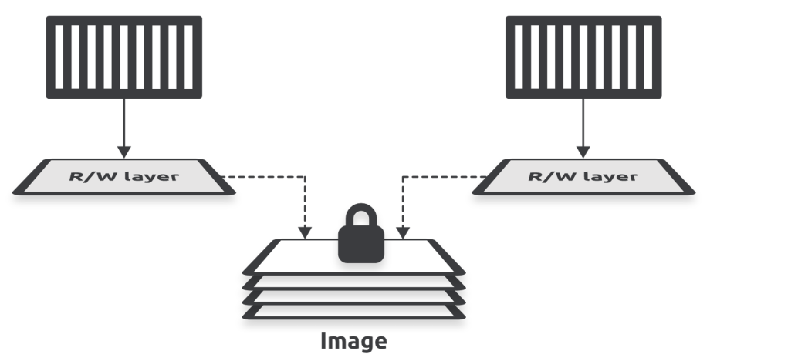

# Chapter 3: Working with containers

* Containers are run-time instances of images, and you can start one or more containers from a single image.

* You can start, stop, restart, and delete containers just like you can with VMs.
* Containers are smaller, faster, and more portable than VMs.
* They’re also designed to be stateless and ephemeral.
* Containers are also designed to be immutable.
  * This means you shouldn’t change them after you’ve deployed them .
  * If a container fails, you replace it with a new one instead of connecting to it and making the fix in the live instance.
* Containers should only run a single process and we use them to build microservices apps.
  * For example, an application with four features (microservices), such as a web server, auth, catalog, and store, will have four containers
    * one running the web server
    * one running the web server
    * one running the web server
    * one running the web server
   

## Containers vs VMs

* Containers and VMs are both virtualization technologies for running applications.
* However, the ways they virtualize are very different:
  * VMs virtualize hardware.
  * Containers virtualize operating systems.
 ### 1. Virutal Machines: 
* In the VM model, you power on a server and a hypervisor boots.
* When the hypervisor boots, it claims all hardware resources such as CPU, RAM, storage, and network adapters.
* To deploy an app, you ask the hypervisor to create a virtual machine.
* It does this by carving up the hardware resources into virtual versions, such as virtual CPUs and Virtual RAM, and packaging them into a VM that looks exactly like a physical server.
* Once you have the VM, you install an OS and then an app

 ### 2. Container Model:
* you power on the same server and an OS boots and claims all hardware resources.
* You then install a container engine such as Docker.
* You then install a container engine such as Docker.
* It does this by carving up OS resources such as process trees and filesystems into virtual versions and then packaging them as a container that looks exactly like a regular OS.
* You then tell Docker to run the app in the container.

    
   

* Containers are smaller than VMs because they only contain application code and a minimal set of OS-related constructs, such as essential filesystem objects.
* Because of this, they’re typically only a few megabytes in size.
* On the other hand, every VM needs a full OS, meaning they’re usually hundreds or thousands of megabytes.
* Containers also start faster than VMs because they use the host’s OS which is already booted.
* On the other hand, VMs need to go through a full OS bootstrapping process before starting the app.

## Images and Containers

* The image is read-only in this relationship, but each container is read-write.
* Docker accomplishes this by creating a thin read-write layer for each container and placing it on top of the shared image.
  

    
   

* In this example, each container has its own thin R/W layer but shares the same image.
* The containers can see and access the files and apps in the image through their own R/W layer, and if they make any changes, these get written to their R/W layer
* When you stop a container, Docker keeps the R/W layer and restores it when you restart the container.
* When you stop a container, Docker keeps the R/W layer and restores it when you restart the container.
* This way, each container can make and keep its own changes without changing the shared image

