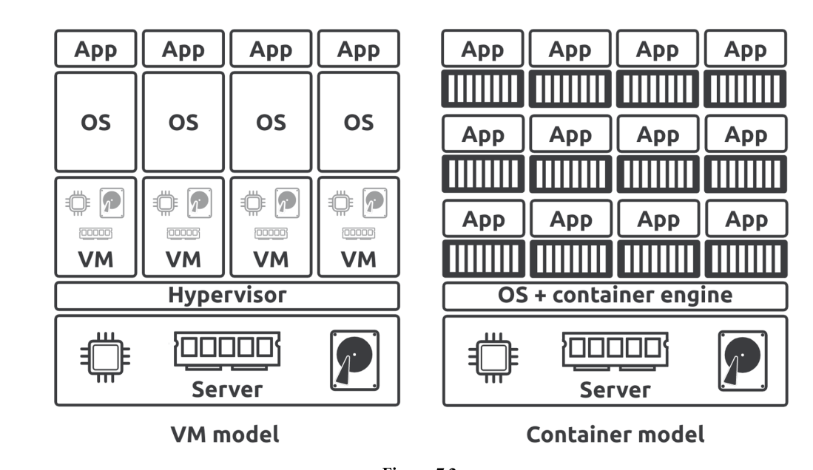

# Chapter 3: Working with containers

* Containers are run-time instances of images, and you can start one or more containers from a single image.

* You can start, stop, restart, and delete containers just like you can with VMs.
* Containers are smaller, faster, and more portable than VMs.
* They’re also designed to be stateless and ephemeral.
* Containers are also designed to be immutable.
  * This means you shouldn’t change them after you’ve deployed them .
  * If a container fails, you replace it with a new one instead of connecting to it and making the fix in the live instance.
* Containers should only run a single process and we use them to build microservices apps.
  * For example, an application with four features (microservices), such as a web server, auth, catalog, and store, will have four containers
    * one running the web server
    * one running the web server
    * one running the web server
    * one running the web server
   

## Containers vs VMs

* Containers and VMs are both virtualization technologies for running applications.
* However, the ways they virtualize are very different:
  * VMs virtualize hardware.
  * Containers virtualize operating systems.
 ### 1. Virutal Machines: 
* In the VM model, you power on a server and a hypervisor boots.
* When the hypervisor boots, it claims all hardware resources such as CPU, RAM, storage, and network adapters.
* To deploy an app, you ask the hypervisor to create a virtual machine.
* It does this by carving up the hardware resources into virtual versions, such as virtual CPUs and Virtual RAM, and packaging them into a VM that looks exactly like a physical server.
* Once you have the VM, you install an OS and then an app

 ### 2. Container Model:
* you power on the same server and an OS boots and claims all hardware resources.
* You then install a container engine such as Docker.
* You then install a container engine such as Docker.
* It does this by carving up OS resources such as process trees and filesystems into virtual versions and then packaging them as a container that looks exactly like a regular OS.
* You then tell Docker to run the app in the container.

<p align="center">
    
   </p>

* Containers are smaller than VMs because they only contain application code and a minimal set of OS-related constructs, such as essential filesystem objects.
* Because of this, they’re typically only a few megabytes in size.
* On the other hand, every VM needs a full OS, meaning they’re usually hundreds or thousands of megabytes.
* Containers also start faster than VMs because they use the host’s OS which is already booted.
* On the other hand, VMs need to go through a full OS bootstrapping process before starting the app.

## Images and Containers

* The image is read-only in this relationship, but each container is read-write.
* Docker accomplishes this by creating a thin read-write layer for each container and placing it on top of the shared image.
  <p align="center">
    
   </p>
* In this example, each container has its own thin R/W layer but shares the same image.
* The containers can see and access the files and apps in the image through their own R/W layer, and if they make any changes, these get written to their R/W layer
* When you stop a container, Docker keeps the R/W layer and restores it when you restart the container.
* When you stop a container, Docker keeps the R/W layer and restores it when you restart the container.
* This way, each container can make and keep its own changes without changing the shared image

## Containers Quick Start using an example 

### 1. Check Docker is running
* Run a docker version to check Docker is running
  ```bash
  docker version
  ```
### 2. Starting a container
* The docker run command is the simplest and most common way to start a new container.

* Run the following command to start a new container called webserver.
  ```bash
  docker run -d --name webserver -p 5005:8080 nigelpoulton/ddd-book:web0.1
  ```
     * `-d` flag: tells Docker to run it in the background as a daemon process and detached from your local terminal
       * Without `-d`, the container runs in the foreground and you’ll see all of its logs in your terminal. You’d need another terminal tab to keep working.
       * With `-d`, the container runs as a background process, and Docker prints the container ID (`b5594b3`... in your case)
     * `name` flag: tells Docker to name this container `webserver`.

     * `-p 5005:8080` flag: flag maps port 5005 on your local system to port 8080 inside the container.
       * `8080` (container port): the app inside the container listens on `port 8080`.
       * `5005` (host port): you expose it to your machine (the host) on `port 5005`.
       * If you open `http://localhost:5005` in your browser, Docker forwards that traffic into the container’s port `8080`.
       * Without this mapping, the container’s web server would still run, but only inside the container — your host system wouldn’t see it.
       * Container says: “I’m listening on port 8080.”. Host says: “Okay, I’ll let people talk to you through my port 5005.”
       * Docker wires 5005 → 8080.
     * The `nigelpoulton/ddd-book:web0.1` argument tells Docker which image to use to start the container.
     * When you hit `Return`, the Docker client converted the command into an API request and posted it to the Docker API exposed by the Docker daemon.
     * The Docker daemon accepted the command and searched its local image repository for a copy of the `nigelpoulton/ddd-book:web0.1` image.
     * It didn’t find one, so it searched Docker Hub. In the example, it found one on Docker Hub and pulled a local copy.
     * Once it had a local copy of the image, the daemon made a request to containerd asking for a new container.
     * containerd then instructed runc to create the container and start the app. It also performed the port mapping.

* Run the following command to verify the image was pulled locally:
  ```bash
  docker images
  ```
  * Ouput:
   ```bash
   nigelpoulton/ddd-book   web0.1    24e712542f5f   9 months ago   208MB
   ```
* Run the following command a new container called webserver is running:
  ```bash
  docker ps
  ```
  * Ouput:
    ```bash
    CONTAINER ID   IMAGE                          COMMAND           CREATED          STATUS          PORTS                                         NAMES
    e9686ad32140   nigelpoulton/ddd-book:web0.1   "node ./app.js"   42 minutes ago   Up 42 minutes   0.0.0.0:5005->8080/tcp, [::]:5005->8080/tcp   webserver
    ```
* To test the app, connect to the browser and run:
  ```bash
  http://localhost:5005/
  ```
* Congratulations. Docker pulled a local copy of the image and started a container running the app defined in the image.


## How containers start apps

* In the previous section, you created a container running a web app.
* But how did the container know which app to start and how to start it?
* There are three ways you can tell Docker how to start an app in a container:
  * **1. An Entrypoint instruction in the image.**
  * **2. A Cmd instruction in the image.**
  * **3. A CLI argument.** 

* Entrypoint and Cmd instruc-tions are optional image metadata that store the command Docker uses to start the default app.

* Then, whenever you start a container from the image, Docker checks the Entrypoint or Cmd instruction and executes the stored command.
* Entrypoint instructions cannot be overridden on the CLI, and anything you pass in via the CLI will be appended to the Entrypoint instruction as an argument.
* Cmd instructions can be overridden by CLI arguments
* Run the following command to see if the nigelpoulton/ddd-book:web0.1 image has an Entrypoint instruction.
  ```bash
  docker inspect nigelpoulton/ddd-book:web0.1 | grep Entrypoint -A 3
  ```
  * The command searches the image metadata and returns any lines containing the word “Entrypoint” and the three lines immediately following it.
  * Output:
    ```bash
    "Entrypoint": [
                "node",
                "./app.js"
            ],
    ```

  * This image has an Entrypoint instruction that translates into the following command — `node ./app.js`.
  * If you’re not familiar with Node.js, it’s a simple command telling the Node.js runtime to execute the code in the `app.js` file. 

* If an image doesn’t have an Entrypoint instruction, you can search for the presence of a Cmd instruction.
* If an image doesn’t have either, you’ll need to pass an argument on the CLI.
* The format of the docker run command is:
  ```bash
  docker run <arguments> <image> <command>
  ```
  * As mentioned, the <command> is optional
  * you don’t need it if the image has an Entrypoint or Cmd instruction.
  * f you specify a <command>, it will override a Cmd instruction but will be appended to an Entrypoint instruction.
  * Example:
    ```bash
    docker run --rm -d alpine sleep 20
    ```
    * The following command starts a new background container based on the Alpine image and tells it to run the sleep 20 command, causing it to run for 20 seconds and then exit.
    * The --rm flag cleans up the exited container so you don’t have to delete it manually.
    * If you run a docker ps command before the 20-second sleep timer expires, you’ll see the container in the output
    * If you run it after 20 seconds, the container will be gone.The `--rm` argument automatically cleans up the exited container.

* Most production images will specify an Entrypoint or Cmd instruction.


## Connecting to a container


